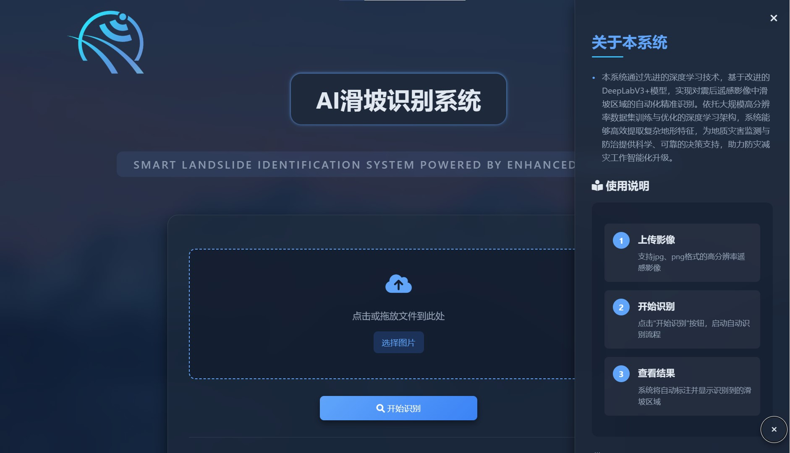

# AI滑坡识别项目 /AI Landslide Identification

## 项目简介 / Project Overview

本项目基于改进的DeepLabV3+模型，旨在实现对震后遥感影像中滑坡区域的自动化精准识别。通过大规模高分辨率数据集训练与优化，结合深度学习架构，该系统能够高效提取复杂地形特征，为地质灾害监测与防治提供科学、可靠的决策支持，助力防灾减灾工作智能化升级。

This project is based on an improved version of the DeepLabV3+ model to automatically and accurately identify landslide areas in post-earthquake remote sensing images. With large-scale high-resolution datasets for training and optimization, the deep learning architecture efficiently extracts complex terrain features, providing reliable decision support for geological disaster monitoring and prevention, thus aiding the intelligent upgrading of disaster prevention and mitigation work.

## 功能特点 / Features

- **基于DeepLabV3+模型**：通过改进的深度学习模型，提升遥感影像中滑坡区域的识别准确率和效率。
    - Based on the DeepLabV3+ model: Improved deep learning model to enhance the accuracy and efficiency of landslide area identification in remote sensing images.
- **大规模高分辨率数据集**：通过大规模高分辨率遥感数据集的训练，系统可以有效识别复杂地形下的滑坡区域。
    - Large-scale high-resolution dataset: The system efficiently identifies landslide areas in complex terrains by training on a large-scale high-resolution remote sensing dataset.
- **可视化界面**：提供用户友好的界面，用户可以轻松上传遥感影像并查看滑坡识别结果。
    - Visual interface: Provides a user-friendly interface where users can easily upload remote sensing images and view the landslide identification results.

## 数据集 / Dataset

本项目使用的滑坡数据集由 [ZhaoTong0203](https://github.com/ZhaoTong0203/landslides_identification_model_code) 提供，特此感谢其为该项目提供宝贵的数据支持。

The landslide dataset used in this project is provided by [ZhaoTong0203](https://github.com/ZhaoTong0203/landslides_identification_model_code). We sincerely thank them for their valuable data contribution to this project.

[滑坡数据集](https://github.com/ZhaoTong0203/landslides_identification_model_code)  
[Landslide Dataset](https://github.com/ZhaoTong0203/landslides_identification_model_code)

## 系统架构 / System Architecture

系统基于改进的DeepLabV3+模型，通过深度神经网络对遥感影像进行特征提取和分类，自动识别出滑坡区域。界面部分使用Flask框架实现，用户通过Web浏览器访问系统。

The system is based on the improved DeepLabV3+ model, using deep neural networks to extract features and classify remote sensing images, automatically identifying landslide areas. The interface is built using the Flask framework, allowing users to access the system via a web browser.

## 使用方法 / Usage Instructions

### 1. 拉取项目 / Clone the Repository

首先，您需要将项目从GitHub拉取到本地：

First, clone the project from GitHub:

```bash
git clone https://github.com/xfjm136/AI-Landside-Identification.git
cd AI-Landside-Identification
```

### 2. 安装依赖 / Install Dependencies

确保您已安装Python环境（建议Python 3.6及以上版本）。然后使用以下命令安装项目所需的依赖：

Make sure you have Python installed (Python 3.6 or above is recommended). Then use the following command to install the required dependencies:

```bash
pip install -r requirements.txt
```

### 3. 启动项目 / Run the Project

安装依赖后，运行以下命令启动应用：

After installing the dependencies, run the following command to start the application:

```bash
python app.py
```

### 4. 访问应用 / Access the Application

应用启动后，打开浏览器并访问 [localhost:5000](http://localhost:5000/)，即可上传遥感影像并查看滑坡区域的自动化识别结果。

Once the application is running, open your browser and visit [localhost:5000](http://localhost:5000/). You can upload remote sensing images and view the automatic identification results of the landslide areas.

## 界面截图 / Interface Screenshots

  
_图1：应用界面截图 / Figure 1: Application Interface Screenshot_
## 贡献 / Contributing

我们欢迎任何形式的贡献，包括报告问题、提交改进建议以及拉取请求。

We welcome all forms of contributions, including reporting issues, submitting improvement suggestions, and pull requests (PRs). 

## 联系方式 / Contact Information

如有任何问题或建议，请通过以下方式联系：

For any questions or suggestions, please contact us via:

- GitHub 页面：[https://github.com/xfjm136/AI-Landside-Identification.git](https://github.com/xfjm136/AI-Landside-Identification.git)
- 邮箱：[xfjm136@163.com](xfjm136@631.com)

---
